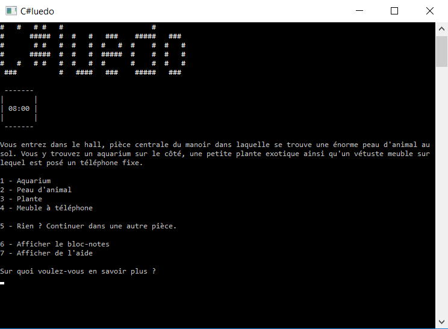

# C#luedo - un jeu CLI

C#luedo est un jeu en ligne de commandes, les interactions se font au travers de texte. Il s'inspire du célèbre jeu "Cluedo", ici destiné à un seul joueur. Le personnage interprété par le joueur est un inspecteur qui doit trouver qui a tué le Docteur Lenoir et avec quelle arme a été commis le meurtre.

Les scénarios sont enregistrés dans des fichiers XML. Ainsi, il est possible d'ajouter simplement des scénarios au jeu, en français ou dans n'importe quelle langue. Les balises utilisées sont très simples, en plus de quelques shortcodes pour inclure par exemple le nom du personnage.

Six personnes sont suspectées d'avoir commis le meurtre, et sont présentes dans six pièces différentes du manoir. Six armes sont également réparties dans le manoir. Les pièces contiennent des objets qu'il est possible d'observer pour en apprendre davantage, ainsi que des passages possibles entre elles par des portes ouvertes. Certains déplacements peuvent s'ajouter via des passages secrets.

Selon la pièce dans laquelle se trouve le joueur et son contenu (un suspect et/ou une arme ou aucun des deux), différentes actions s'offrent à lui. Chaque type d'action prend un certain temps à être effectué, et l’inspecteur a un temps limité pour résoudre l'affaire.

L'inspecteur est doté d'un inventaire dans lequel il peut déposer certains objets. Dès le début et tout au long de la partie, un bloc-notes est présent dans son inventaire, dans lequel il écrit au fur et à mesure de l'enquête les informations qu’il apprend.

## Plateforme

C#luedo est un exécutable Windows. Il a été testé sur Windows 7 et 10.
Vous pouvez le télécharger dans sa version exécutable ici : [C-luedo.zip](C-luedo.zip)

C#luedo a été conçu et développé par Louise Mathieu et Fabien Monniot.
